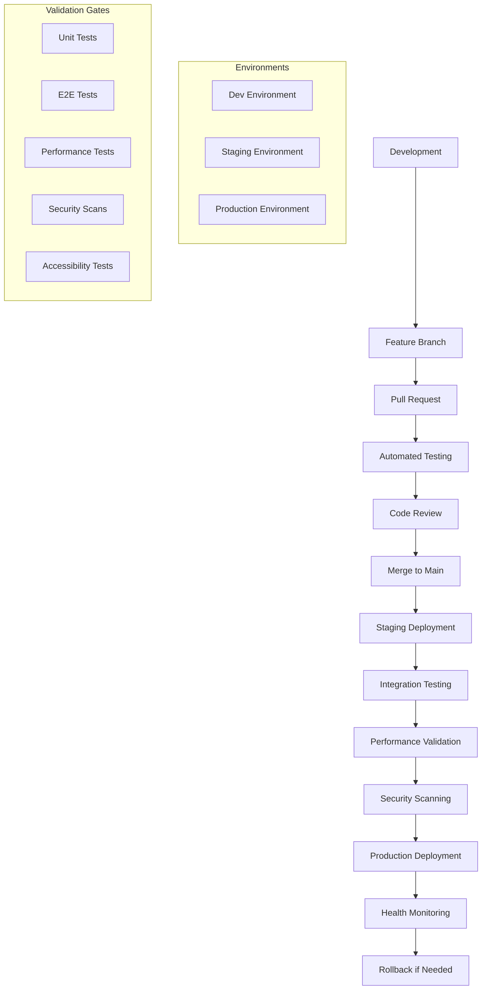

# Real-time Charts Deployment - A→M Workflow Step L

**PAGE_KEY**: realtime-charts
**COMPLETION DATE**: 2025-01-29
**STATUS**: ✅ COMPLETE

## Deployment Strategy Overview

### Multi-Environment Deployment Pipeline



### Deployment Configuration Files

#### Docker Configuration

```dockerfile
# Dockerfile for Real-time Charts Application
FROM node:18-alpine AS builder

# Set working directory
WORKDIR /app

# Copy package files
COPY package*.json ./
COPY angular.json ./
COPY tsconfig*.json ./

# Install dependencies
RUN npm ci --only=production

# Copy source code
COPY src/ ./src/
COPY public/ ./public/

# Build application for production
RUN npm run build:prod

# Production stage
FROM nginx:alpine

# Copy built application
COPY --from=builder /app/dist /usr/share/nginx/html

# Copy nginx configuration
COPY deployment/nginx/nginx.conf /etc/nginx/nginx.conf
COPY deployment/nginx/charts-site.conf /etc/nginx/conf.d/default.conf

# Copy SSL certificates (if using HTTPS)
COPY deployment/ssl/ /etc/nginx/ssl/

# Health check
HEALTHCHECK --interval=30s --timeout=3s --start-period=5s --retries=3 \
  CMD curl -f http://localhost/health || exit 1

# Expose port
EXPOSE 80 443

# Start nginx
CMD ["nginx", "-g", "daemon off;"]
```

```yaml
# docker-compose.yml for local development
version: '3.8'

services:
  wesign-charts-app:
    build:
      context: .
      dockerfile: Dockerfile
    container_name: wesign-charts-dev
    ports:
      - "4200:80"
    environment:
      - NODE_ENV=development
      - API_URL=http://localhost:5000
      - SIGNALR_URL=ws://localhost:5000/analyticsHub
    volumes:
      - ./src:/app/src:ro
      - ./public:/app/public:ro
    depends_on:
      - wesign-api
      - wesign-signalr
    networks:
      - wesign-network

  wesign-api:
    image: wesign/api:latest
    container_name: wesign-api-dev
    ports:
      - "5000:80"
    environment:
      - ASPNETCORE_ENVIRONMENT=Development
      - ConnectionStrings__DefaultConnection=Server=db;Database=WeSign;User=sa;Password=DevPassword123!
    depends_on:
      - db
    networks:
      - wesign-network

  wesign-signalr:
    image: wesign/signalr-hub:latest
    container_name: wesign-signalr-dev
    ports:
      - "5001:80"
    environment:
      - ASPNETCORE_ENVIRONMENT=Development
      - Redis__ConnectionString=redis:6379
    depends_on:
      - redis
    networks:
      - wesign-network

  db:
    image: mcr.microsoft.com/mssql/server:2019-latest
    container_name: wesign-db-dev
    environment:
      - ACCEPT_EULA=Y
      - SA_PASSWORD=DevPassword123!
    ports:
      - "1433:1433"
    volumes:
      - db-data:/var/opt/mssql
    networks:
      - wesign-network

  redis:
    image: redis:7-alpine
    container_name: wesign-redis-dev
    ports:
      - "6379:6379"
    volumes:
      - redis-data:/data
    networks:
      - wesign-network

volumes:
  db-data:
  redis-data:

networks:
  wesign-network:
    driver: bridge
```

#### Kubernetes Deployment

```yaml
# k8s/namespace.yaml
apiVersion: v1
kind: Namespace
metadata:
  name: wesign-charts
  labels:
    name: wesign-charts
    environment: production

---
# k8s/configmap.yaml
apiVersion: v1
kind: ConfigMap
metadata:
  name: wesign-charts-config
  namespace: wesign-charts
data:
  API_URL: "https://api.wesign.com"
  SIGNALR_URL: "wss://api.wesign.com/analyticsHub"
  ENABLE_ANALYTICS: "true"
  CHART_UPDATE_INTERVAL: "5000"
  MAX_DATA_POINTS: "10000"
  ENABLE_REAL_TIME: "true"

---
# k8s/secret.yaml
apiVersion: v1
kind: Secret
metadata:
  name: wesign-charts-secrets
  namespace: wesign-charts
type: Opaque
data:
  jwt-secret: <base64-encoded-jwt-secret>
  api-key: <base64-encoded-api-key>

---
# k8s/deployment.yaml
apiVersion: apps/v1
kind: Deployment
metadata:
  name: wesign-charts-deployment
  namespace: wesign-charts
  labels:
    app: wesign-charts
    version: v1.0.0
spec:
  replicas: 3
  strategy:
    type: RollingUpdate
    rollingUpdate:
      maxSurge: 1
      maxUnavailable: 1
  selector:
    matchLabels:
      app: wesign-charts
  template:
    metadata:
      labels:
        app: wesign-charts
        version: v1.0.0
      annotations:
        prometheus.io/scrape: "true"
        prometheus.io/port: "8080"
        prometheus.io/path: "/metrics"
    spec:
      containers:
      - name: wesign-charts
        image: wesign/charts:1.0.0
        ports:
        - containerPort: 80
          name: http
        - containerPort: 8080
          name: metrics
        env:
        - name: NODE_ENV
          value: "production"
        envFrom:
        - configMapRef:
            name: wesign-charts-config
        - secretRef:
            name: wesign-charts-secrets
        resources:
          requests:
            memory: "256Mi"
            cpu: "100m"
          limits:
            memory: "512Mi"
            cpu: "500m"
        livenessProbe:
          httpGet:
            path: /health
            port: 80
          initialDelaySeconds: 30
          periodSeconds: 10
          timeoutSeconds: 5
          failureThreshold: 3
        readinessProbe:
          httpGet:
            path: /ready
            port: 80
          initialDelaySeconds: 5
          periodSeconds: 5
          timeoutSeconds: 3
          failureThreshold: 3
        volumeMounts:
        - name: nginx-config
          mountPath: /etc/nginx/conf.d
          readOnly: true
        - name: ssl-certs
          mountPath: /etc/nginx/ssl
          readOnly: true
      volumes:
      - name: nginx-config
        configMap:
          name: nginx-charts-config
      - name: ssl-certs
        secret:
          secretName: wesign-ssl-certs
      imagePullSecrets:
      - name: wesign-registry-secret

---
# k8s/service.yaml
apiVersion: v1
kind: Service
metadata:
  name: wesign-charts-service
  namespace: wesign-charts
  labels:
    app: wesign-charts
spec:
  type: ClusterIP
  ports:
  - port: 80
    targetPort: 80
    protocol: TCP
    name: http
  - port: 8080
    targetPort: 8080
    protocol: TCP
    name: metrics
  selector:
    app: wesign-charts

---
# k8s/ingress.yaml
apiVersion: networking.k8s.io/v1
kind: Ingress
metadata:
  name: wesign-charts-ingress
  namespace: wesign-charts
  annotations:
    kubernetes.io/ingress.class: nginx
    nginx.ingress.kubernetes.io/ssl-redirect: "true"
    nginx.ingress.kubernetes.io/force-ssl-redirect: "true"
    nginx.ingress.kubernetes.io/proxy-body-size: "10m"
    nginx.ingress.kubernetes.io/proxy-read-timeout: "3600"
    nginx.ingress.kubernetes.io/proxy-send-timeout: "3600"
    nginx.ingress.kubernetes.io/websocket-services: "wesign-charts-service"
    cert-manager.io/cluster-issuer: "letsencrypt-prod"
spec:
  tls:
  - hosts:
    - charts.wesign.com
    secretName: wesign-charts-tls
  rules:
  - host: charts.wesign.com
    http:
      paths:
      - path: /
        pathType: Prefix
        backend:
          service:
            name: wesign-charts-service
            port:
              number: 80

---
# k8s/hpa.yaml
apiVersion: autoscaling/v2
kind: HorizontalPodAutoscaler
metadata:
  name: wesign-charts-hpa
  namespace: wesign-charts
spec:
  scaleTargetRef:
    apiVersion: apps/v1
    kind: Deployment
    name: wesign-charts-deployment
  minReplicas: 3
  maxReplicas: 10
  metrics:
  - type: Resource
    resource:
      name: cpu
      target:
        type: Utilization
        averageUtilization: 70
  - type: Resource
    resource:
      name: memory
      target:
        type: Utilization
        averageUtilization: 80
  behavior:
    scaleDown:
      stabilizationWindowSeconds: 300
      policies:
      - type: Percent
        value: 10
        periodSeconds: 60
    scaleUp:
      stabilizationWindowSeconds: 60
      policies:
      - type: Percent
        value: 50
        periodSeconds: 60

---
# k8s/pdb.yaml
apiVersion: policy/v1
kind: PodDisruptionBudget
metadata:
  name: wesign-charts-pdb
  namespace: wesign-charts
spec:
  minAvailable: 2
  selector:
    matchLabels:
      app: wesign-charts
```

#### NGINX Configuration

```nginx
# deployment/nginx/nginx.conf
user nginx;
worker_processes auto;
error_log /var/log/nginx/error.log warn;
pid /var/run/nginx.pid;

events {
    worker_connections 1024;
    use epoll;
    multi_accept on;
}

http {
    include /etc/nginx/mime.types;
    default_type application/octet-stream;

    # Logging format
    log_format main '$remote_addr - $remote_user [$time_local] "$request" '
                    '$status $body_bytes_sent "$http_referer" '
                    '"$http_user_agent" "$http_x_forwarded_for" '
                    'rt=$request_time uct="$upstream_connect_time" '
                    'uht="$upstream_header_time" urt="$upstream_response_time"';

    access_log /var/log/nginx/access.log main;

    # Basic settings
    sendfile on;
    tcp_nopush on;
    tcp_nodelay on;
    keepalive_timeout 65;
    types_hash_max_size 2048;
    server_tokens off;

    # Gzip compression
    gzip on;
    gzip_vary on;
    gzip_proxied any;
    gzip_comp_level 6;
    gzip_types
        text/plain
        text/css
        text/xml
        text/javascript
        application/json
        application/javascript
        application/xml+rss
        application/atom+xml
        image/svg+xml;

    # Rate limiting
    limit_req_zone $binary_remote_addr zone=api:10m rate=10r/s;
    limit_req_zone $binary_remote_addr zone=charts:10m rate=50r/s;

    # Include site configurations
    include /etc/nginx/conf.d/*.conf;
}
```

```nginx
# deployment/nginx/charts-site.conf
server {
    listen 80;
    listen [::]:80;
    server_name charts.wesign.com;

    # Redirect HTTP to HTTPS
    return 301 https://$server_name$request_uri;
}

server {
    listen 443 ssl http2;
    listen [::]:443 ssl http2;
    server_name charts.wesign.com;

    # SSL Configuration
    ssl_certificate /etc/nginx/ssl/charts.wesign.com.crt;
    ssl_certificate_key /etc/nginx/ssl/charts.wesign.com.key;
    ssl_protocols TLSv1.2 TLSv1.3;
    ssl_ciphers ECDHE-RSA-AES256-GCM-SHA512:DHE-RSA-AES256-GCM-SHA512;
    ssl_prefer_server_ciphers off;
    ssl_session_cache shared:SSL:10m;
    ssl_session_timeout 10m;

    # Security headers
    add_header X-Frame-Options "SAMEORIGIN" always;
    add_header X-Content-Type-Options "nosniff" always;
    add_header X-XSS-Protection "1; mode=block" always;
    add_header Referrer-Policy "strict-origin-when-cross-origin" always;
    add_header Strict-Transport-Security "max-age=31536000; includeSubDomains" always;

    # Content Security Policy
    add_header Content-Security-Policy "default-src 'self'; script-src 'self' 'unsafe-inline' https://cdn.jsdelivr.net; style-src 'self' 'unsafe-inline' https://fonts.googleapis.com; img-src 'self' data: blob:; connect-src 'self' https://api.wesign.com wss://api.wesign.com; font-src 'self' https://fonts.gstatic.com;" always;

    # Root directory
    root /usr/share/nginx/html;
    index index.html;

    # Enable gzip for this server
    gzip on;
    gzip_types text/css application/javascript application/json image/svg+xml;

    # Cache static assets
    location ~* \.(js|css|png|jpg|jpeg|gif|ico|svg|woff|woff2|ttf|eot)$ {
        expires 1y;
        add_header Cache-Control "public, immutable";
        access_log off;
    }

    # Chart assets specific caching
    location /assets/chart-libraries/ {
        expires 1y;
        add_header Cache-Control "public, immutable";
        access_log off;
    }

    # API proxy
    location /api/ {
        limit_req zone=api burst=20 nodelay;

        proxy_pass https://api.wesign.com;
        proxy_set_header Host $host;
        proxy_set_header X-Real-IP $remote_addr;
        proxy_set_header X-Forwarded-For $proxy_add_x_forwarded_for;
        proxy_set_header X-Forwarded-Proto $scheme;

        # Timeouts
        proxy_connect_timeout 30s;
        proxy_send_timeout 60s;
        proxy_read_timeout 60s;

        # Buffer settings
        proxy_buffering on;
        proxy_buffer_size 4k;
        proxy_buffers 8 4k;
    }

    # SignalR WebSocket proxy
    location /analyticsHub {
        proxy_pass https://api.wesign.com;
        proxy_http_version 1.1;
        proxy_set_header Upgrade $http_upgrade;
        proxy_set_header Connection "upgrade";
        proxy_set_header Host $host;
        proxy_set_header X-Real-IP $remote_addr;
        proxy_set_header X-Forwarded-For $proxy_add_x_forwarded_for;
        proxy_set_header X-Forwarded-Proto $scheme;

        # WebSocket specific settings
        proxy_cache_bypass $http_upgrade;
        proxy_read_timeout 3600s;
        proxy_send_timeout 3600s;
    }

    # Health check endpoint
    location /health {
        access_log off;
        return 200 "healthy\n";
        add_header Content-Type text/plain;
    }

    # Readiness check
    location /ready {
        access_log off;
        return 200 "ready\n";
        add_header Content-Type text/plain;
    }

    # Main application
    location / {
        limit_req zone=charts burst=100 nodelay;

        try_files $uri $uri/ /index.html;

        # Cache control for HTML files
        location ~* \.html$ {
            expires -1;
            add_header Cache-Control "no-cache, no-store, must-revalidate";
            add_header Pragma "no-cache";
        }
    }

    # Security.txt
    location /.well-known/security.txt {
        return 200 "Contact: security@wesign.com\nExpires: 2025-12-31T23:59:59.000Z\n";
        add_header Content-Type text/plain;
    }

    # Deny access to sensitive files
    location ~ /\. {
        deny all;
        access_log off;
        log_not_found off;
    }

    location ~ /(\.env|config\.json|package\.json)$ {
        deny all;
        access_log off;
        log_not_found off;
    }
}
```

### Cloud Deployment Configurations

#### AWS ECS Deployment

```json
{
  "family": "wesign-charts-task",
  "networkMode": "awsvpc",
  "requiresCompatibilities": ["FARGATE"],
  "cpu": "1024",
  "memory": "2048",
  "executionRoleArn": "arn:aws:iam::123456789012:role/ecsTaskExecutionRole",
  "taskRoleArn": "arn:aws:iam::123456789012:role/ecsTaskRole",
  "containerDefinitions": [
    {
      "name": "wesign-charts",
      "image": "123456789012.dkr.ecr.us-west-2.amazonaws.com/wesign/charts:1.0.0",
      "portMappings": [
        {
          "containerPort": 80,
          "protocol": "tcp"
        }
      ],
      "environment": [
        {
          "name": "NODE_ENV",
          "value": "production"
        },
        {
          "name": "API_URL",
          "value": "https://api.wesign.com"
        }
      ],
      "secrets": [
        {
          "name": "JWT_SECRET",
          "valueFrom": "arn:aws:secretsmanager:us-west-2:123456789012:secret:wesign/jwt-secret"
        }
      ],
      "logConfiguration": {
        "logDriver": "awslogs",
        "options": {
          "awslogs-group": "/ecs/wesign-charts",
          "awslogs-region": "us-west-2",
          "awslogs-stream-prefix": "ecs"
        }
      },
      "healthCheck": {
        "command": [
          "CMD-SHELL",
          "curl -f http://localhost/health || exit 1"
        ],
        "interval": 30,
        "timeout": 5,
        "retries": 3,
        "startPeriod": 60
      }
    }
  ]
}
```

#### AWS CloudFormation Template

```yaml
# cloudformation/wesign-charts-infrastructure.yaml
AWSTemplateFormatVersion: '2010-09-09'
Description: 'WeSign Charts Infrastructure'

Parameters:
  Environment:
    Type: String
    Default: production
    AllowedValues: [development, staging, production]

  DomainName:
    Type: String
    Default: charts.wesign.com

  CertificateArn:
    Type: String
    Description: SSL Certificate ARN for HTTPS

Resources:
  # VPC and Networking
  VPC:
    Type: AWS::EC2::VPC
    Properties:
      CidrBlock: 10.0.0.0/16
      EnableDnsHostnames: true
      EnableDnsSupport: true
      Tags:
        - Key: Name
          Value: !Sub '${Environment}-wesign-charts-vpc'

  PublicSubnet1:
    Type: AWS::EC2::Subnet
    Properties:
      VpcId: !Ref VPC
      AvailabilityZone: !Select [0, !GetAZs '']
      CidrBlock: 10.0.1.0/24
      MapPublicIpOnLaunch: true
      Tags:
        - Key: Name
          Value: !Sub '${Environment}-public-subnet-1'

  PublicSubnet2:
    Type: AWS::EC2::Subnet
    Properties:
      VpcId: !Ref VPC
      AvailabilityZone: !Select [1, !GetAZs '']
      CidrBlock: 10.0.2.0/24
      MapPublicIpOnLaunch: true
      Tags:
        - Key: Name
          Value: !Sub '${Environment}-public-subnet-2'

  # Internet Gateway
  InternetGateway:
    Type: AWS::EC2::InternetGateway
    Properties:
      Tags:
        - Key: Name
          Value: !Sub '${Environment}-igw'

  InternetGatewayAttachment:
    Type: AWS::EC2::VPCGatewayAttachment
    Properties:
      InternetGatewayId: !Ref InternetGateway
      VpcId: !Ref VPC

  # Route Table
  PublicRouteTable:
    Type: AWS::EC2::RouteTable
    Properties:
      VpcId: !Ref VPC
      Tags:
        - Key: Name
          Value: !Sub '${Environment}-public-rt'

  DefaultPublicRoute:
    Type: AWS::EC2::Route
    DependsOn: InternetGatewayAttachment
    Properties:
      RouteTableId: !Ref PublicRouteTable
      DestinationCidrBlock: 0.0.0.0/0
      GatewayId: !Ref InternetGateway

  PublicSubnet1RouteTableAssociation:
    Type: AWS::EC2::SubnetRouteTableAssociation
    Properties:
      RouteTableId: !Ref PublicRouteTable
      SubnetId: !Ref PublicSubnet1

  PublicSubnet2RouteTableAssociation:
    Type: AWS::EC2::SubnetRouteTableAssociation
    Properties:
      RouteTableId: !Ref PublicRouteTable
      SubnetId: !Ref PublicSubnet2

  # Security Groups
  ALBSecurityGroup:
    Type: AWS::EC2::SecurityGroup
    Properties:
      GroupDescription: Security group for Application Load Balancer
      VpcId: !Ref VPC
      SecurityGroupIngress:
        - IpProtocol: tcp
          FromPort: 80
          ToPort: 80
          CidrIp: 0.0.0.0/0
        - IpProtocol: tcp
          FromPort: 443
          ToPort: 443
          CidrIp: 0.0.0.0/0
      Tags:
        - Key: Name
          Value: !Sub '${Environment}-alb-sg'

  ECSSecurityGroup:
    Type: AWS::EC2::SecurityGroup
    Properties:
      GroupDescription: Security group for ECS tasks
      VpcId: !Ref VPC
      SecurityGroupIngress:
        - IpProtocol: tcp
          FromPort: 80
          ToPort: 80
          SourceSecurityGroupId: !Ref ALBSecurityGroup
      Tags:
        - Key: Name
          Value: !Sub '${Environment}-ecs-sg'

  # Application Load Balancer
  ApplicationLoadBalancer:
    Type: AWS::ElasticLoadBalancingV2::LoadBalancer
    Properties:
      Name: !Sub '${Environment}-wesign-charts-alb'
      Scheme: internet-facing
      Type: application
      Subnets:
        - !Ref PublicSubnet1
        - !Ref PublicSubnet2
      SecurityGroups:
        - !Ref ALBSecurityGroup
      Tags:
        - Key: Name
          Value: !Sub '${Environment}-wesign-charts-alb'

  # Target Group
  TargetGroup:
    Type: AWS::ElasticLoadBalancingV2::TargetGroup
    Properties:
      Name: !Sub '${Environment}-wesign-charts-tg'
      Port: 80
      Protocol: HTTP
      VpcId: !Ref VPC
      TargetType: ip
      HealthCheckPath: /health
      HealthCheckProtocol: HTTP
      HealthCheckIntervalSeconds: 30
      HealthCheckTimeoutSeconds: 5
      HealthyThresholdCount: 2
      UnhealthyThresholdCount: 3

  # ALB Listener
  ALBListener:
    Type: AWS::ElasticLoadBalancingV2::Listener
    Properties:
      DefaultActions:
        - Type: forward
          TargetGroupArn: !Ref TargetGroup
      LoadBalancerArn: !Ref ApplicationLoadBalancer
      Port: 443
      Protocol: HTTPS
      Certificates:
        - CertificateArn: !Ref CertificateArn

  # ECS Cluster
  ECSCluster:
    Type: AWS::ECS::Cluster
    Properties:
      ClusterName: !Sub '${Environment}-wesign-charts-cluster'
      CapacityProviders:
        - FARGATE
        - FARGATE_SPOT
      DefaultCapacityProviderStrategy:
        - CapacityProvider: FARGATE
          Weight: 1
        - CapacityProvider: FARGATE_SPOT
          Weight: 2

  # ECS Task Definition
  TaskDefinition:
    Type: AWS::ECS::TaskDefinition
    Properties:
      Family: !Sub '${Environment}-wesign-charts-task'
      NetworkMode: awsvpc
      RequiresCompatibilities:
        - FARGATE
      Cpu: 1024
      Memory: 2048
      ExecutionRoleArn: !Ref ECSExecutionRole
      TaskRoleArn: !Ref ECSTaskRole
      ContainerDefinitions:
        - Name: wesign-charts
          Image: !Sub '${AWS::AccountId}.dkr.ecr.${AWS::Region}.amazonaws.com/wesign/charts:latest'
          PortMappings:
            - ContainerPort: 80
          Environment:
            - Name: NODE_ENV
              Value: !Ref Environment
            - Name: API_URL
              Value: https://api.wesign.com
          LogConfiguration:
            LogDriver: awslogs
            Options:
              awslogs-group: !Ref CloudWatchLogGroup
              awslogs-region: !Ref AWS::Region
              awslogs-stream-prefix: ecs

  # ECS Service
  ECSService:
    Type: AWS::ECS::Service
    DependsOn: ALBListener
    Properties:
      ServiceName: !Sub '${Environment}-wesign-charts-service'
      Cluster: !Ref ECSCluster
      TaskDefinition: !Ref TaskDefinition
      DesiredCount: 3
      LaunchType: FARGATE
      NetworkConfiguration:
        AwsvpcConfiguration:
          SecurityGroups:
            - !Ref ECSSecurityGroup
          Subnets:
            - !Ref PublicSubnet1
            - !Ref PublicSubnet2
          AssignPublicIp: ENABLED
      LoadBalancers:
        - ContainerName: wesign-charts
          ContainerPort: 80
          TargetGroupArn: !Ref TargetGroup

  # IAM Roles
  ECSExecutionRole:
    Type: AWS::IAM::Role
    Properties:
      AssumeRolePolicyDocument:
        Version: '2012-10-17'
        Statement:
          - Effect: Allow
            Principal:
              Service: ecs-tasks.amazonaws.com
            Action: sts:AssumeRole
      ManagedPolicyArns:
        - arn:aws:iam::aws:policy/service-role/AmazonECSTaskExecutionRolePolicy
      Policies:
        - PolicyName: SecretsManagerAccess
          PolicyDocument:
            Version: '2012-10-17'
            Statement:
              - Effect: Allow
                Action:
                  - secretsmanager:GetSecretValue
                Resource: !Sub 'arn:aws:secretsmanager:${AWS::Region}:${AWS::AccountId}:secret:wesign/*'

  ECSTaskRole:
    Type: AWS::IAM::Role
    Properties:
      AssumeRolePolicyDocument:
        Version: '2012-10-17'
        Statement:
          - Effect: Allow
            Principal:
              Service: ecs-tasks.amazonaws.com
            Action: sts:AssumeRole
      Policies:
        - PolicyName: CloudWatchLogs
          PolicyDocument:
            Version: '2012-10-17'
            Statement:
              - Effect: Allow
                Action:
                  - logs:CreateLogStream
                  - logs:PutLogEvents
                Resource: !GetAtt CloudWatchLogGroup.Arn

  # CloudWatch Log Group
  CloudWatchLogGroup:
    Type: AWS::Logs::LogGroup
    Properties:
      LogGroupName: !Sub '/ecs/${Environment}-wesign-charts'
      RetentionInDays: 30

  # Auto Scaling
  AutoScalingTarget:
    Type: AWS::ApplicationAutoScaling::ScalableTarget
    Properties:
      MaxCapacity: 10
      MinCapacity: 3
      ResourceId: !Sub 'service/${ECSCluster}/${ECSService.Name}'
      RoleARN: !Sub 'arn:aws:iam::${AWS::AccountId}:role/aws-service-role/ecs.application-autoscaling.amazonaws.com/AWSServiceRoleForApplicationAutoScaling_ECSService'
      ScalableDimension: ecs:service:DesiredCount
      ServiceNamespace: ecs

  AutoScalingPolicy:
    Type: AWS::ApplicationAutoScaling::ScalingPolicy
    Properties:
      PolicyName: !Sub '${Environment}-wesign-charts-scaling-policy'
      PolicyType: TargetTrackingScaling
      ScalingTargetId: !Ref AutoScalingTarget
      TargetTrackingScalingPolicyConfiguration:
        PredefinedMetricSpecification:
          PredefinedMetricType: ECSServiceAverageCPUUtilization
        TargetValue: 70.0
        ScaleOutCooldown: 300
        ScaleInCooldown: 300

Outputs:
  LoadBalancerDNS:
    Description: Load Balancer DNS Name
    Value: !GetAtt ApplicationLoadBalancer.DNSName
    Export:
      Name: !Sub '${Environment}-wesign-charts-alb-dns'

  ECSClusterName:
    Description: ECS Cluster Name
    Value: !Ref ECSCluster
    Export:
      Name: !Sub '${Environment}-wesign-charts-cluster'
```

### Deployment Scripts

#### Automated Deployment Script

```bash
#!/bin/bash
# deploy.sh - Automated deployment script for WeSign Charts

set -euo pipefail

# Configuration
ENVIRONMENT=${1:-staging}
VERSION=${2:-latest}
AWS_REGION=${AWS_REGION:-us-west-2}
AWS_ACCOUNT_ID=${AWS_ACCOUNT_ID:-123456789012}
ECR_REPOSITORY="wesign/charts"
ECS_CLUSTER="${ENVIRONMENT}-wesign-charts-cluster"
ECS_SERVICE="${ENVIRONMENT}-wesign-charts-service"

# Colors for output
RED='\033[0;31m'
GREEN='\033[0;32m'
YELLOW='\033[1;33m'
NC='\033[0m' # No Color

# Logging functions
log_info() {
    echo -e "${GREEN}[INFO]${NC} $1"
}

log_warn() {
    echo -e "${YELLOW}[WARN]${NC} $1"
}

log_error() {
    echo -e "${RED}[ERROR]${NC} $1"
    exit 1
}

# Validate prerequisites
validate_prerequisites() {
    log_info "Validating prerequisites..."

    # Check required tools
    command -v aws >/dev/null 2>&1 || log_error "AWS CLI is required but not installed"
    command -v docker >/dev/null 2>&1 || log_error "Docker is required but not installed"
    command -v jq >/dev/null 2>&1 || log_error "jq is required but not installed"

    # Check AWS credentials
    aws sts get-caller-identity >/dev/null 2>&1 || log_error "AWS credentials not configured"

    # Validate environment
    case $ENVIRONMENT in
        development|staging|production)
            log_info "Deploying to $ENVIRONMENT environment"
            ;;
        *)
            log_error "Invalid environment: $ENVIRONMENT. Must be development, staging, or production"
            ;;
    esac

    log_info "Prerequisites validated ✓"
}

# Build and push Docker image
build_and_push_image() {
    log_info "Building and pushing Docker image..."

    # Get ECR login token
    aws ecr get-login-password --region $AWS_REGION | docker login --username AWS --password-stdin $AWS_ACCOUNT_ID.dkr.ecr.$AWS_REGION.amazonaws.com

    # Build image
    log_info "Building Docker image..."
    docker build -t $ECR_REPOSITORY:$VERSION .
    docker tag $ECR_REPOSITORY:$VERSION $AWS_ACCOUNT_ID.dkr.ecr.$AWS_REGION.amazonaws.com/$ECR_REPOSITORY:$VERSION

    # Push image
    log_info "Pushing image to ECR..."
    docker push $AWS_ACCOUNT_ID.dkr.ecr.$AWS_REGION.amazonaws.com/$ECR_REPOSITORY:$VERSION

    log_info "Image pushed successfully ✓"
}

# Update ECS service
deploy_to_ecs() {
    log_info "Deploying to ECS..."

    # Get current task definition
    TASK_DEFINITION=$(aws ecs describe-task-definition \
        --task-definition "${ENVIRONMENT}-wesign-charts-task" \
        --region $AWS_REGION \
        --query 'taskDefinition' \
        --output json)

    # Update image in task definition
    NEW_TASK_DEFINITION=$(echo $TASK_DEFINITION | jq --arg IMAGE "$AWS_ACCOUNT_ID.dkr.ecr.$AWS_REGION.amazonaws.com/$ECR_REPOSITORY:$VERSION" \
        '.containerDefinitions[0].image = $IMAGE | del(.taskDefinitionArn) | del(.revision) | del(.status) | del(.requiresAttributes) | del(.placementConstraints) | del(.compatibilities) | del(.registeredAt) | del(.registeredBy)')

    # Register new task definition
    log_info "Registering new task definition..."
    NEW_TASK_DEF_ARN=$(echo $NEW_TASK_DEFINITION | aws ecs register-task-definition \
        --region $AWS_REGION \
        --cli-input-json file:///dev/stdin \
        --query 'taskDefinition.taskDefinitionArn' \
        --output text)

    # Update service
    log_info "Updating ECS service..."
    aws ecs update-service \
        --cluster $ECS_CLUSTER \
        --service $ECS_SERVICE \
        --task-definition $NEW_TASK_DEF_ARN \
        --region $AWS_REGION >/dev/null

    log_info "ECS service updated ✓"
}

# Wait for deployment to complete
wait_for_deployment() {
    log_info "Waiting for deployment to complete..."

    # Wait for stable state
    aws ecs wait services-stable \
        --cluster $ECS_CLUSTER \
        --services $ECS_SERVICE \
        --region $AWS_REGION

    # Check deployment status
    DEPLOYMENT_STATUS=$(aws ecs describe-services \
        --cluster $ECS_CLUSTER \
        --services $ECS_SERVICE \
        --region $AWS_REGION \
        --query 'services[0].deployments[0].status' \
        --output text)

    if [ "$DEPLOYMENT_STATUS" = "PRIMARY" ]; then
        log_info "Deployment completed successfully ✓"
    else
        log_error "Deployment failed with status: $DEPLOYMENT_STATUS"
    fi
}

# Health check
health_check() {
    log_info "Performing health check..."

    # Get load balancer URL
    ALB_DNS=$(aws cloudformation describe-stacks \
        --stack-name "${ENVIRONMENT}-wesign-charts-infrastructure" \
        --region $AWS_REGION \
        --query 'Stacks[0].Outputs[?OutputKey==`LoadBalancerDNS`].OutputValue' \
        --output text)

    if [ -z "$ALB_DNS" ]; then
        log_warn "Could not retrieve load balancer DNS, skipping health check"
        return
    fi

    # Wait for health check to pass
    for i in {1..30}; do
        log_info "Health check attempt $i/30..."

        if curl -f -s "https://$ALB_DNS/health" >/dev/null; then
            log_info "Health check passed ✓"
            return
        fi

        sleep 10
    done

    log_error "Health check failed after 30 attempts"
}

# Rollback function
rollback() {
    log_warn "Initiating rollback..."

    # Get previous task definition
    PREVIOUS_TASK_DEF=$(aws ecs describe-services \
        --cluster $ECS_CLUSTER \
        --services $ECS_SERVICE \
        --region $AWS_REGION \
        --query 'services[0].deployments[1].taskDefinition' \
        --output text)

    if [ "$PREVIOUS_TASK_DEF" = "None" ]; then
        log_error "No previous task definition found for rollback"
    fi

    # Update service to previous task definition
    aws ecs update-service \
        --cluster $ECS_CLUSTER \
        --service $ECS_SERVICE \
        --task-definition $PREVIOUS_TASK_DEF \
        --region $AWS_REGION >/dev/null

    log_info "Rollback initiated. Waiting for completion..."
    wait_for_deployment
}

# Cleanup old task definitions
cleanup_old_task_definitions() {
    log_info "Cleaning up old task definitions..."

    # Keep last 10 revisions
    OLD_TASK_DEFS=$(aws ecs list-task-definitions \
        --family-prefix "${ENVIRONMENT}-wesign-charts-task" \
        --status INACTIVE \
        --region $AWS_REGION \
        --query 'taskDefinitionArns[0:-10]' \
        --output text)

    if [ "$OLD_TASK_DEFS" != "None" ]; then
        for task_def in $OLD_TASK_DEFS; do
            aws ecs deregister-task-definition \
                --task-definition $task_def \
                --region $AWS_REGION >/dev/null
        done
        log_info "Cleaned up old task definitions ✓"
    else
        log_info "No old task definitions to clean up"
    fi
}

# Main deployment function
main() {
    log_info "Starting deployment of WeSign Charts v$VERSION to $ENVIRONMENT"

    # Set up error handling
    trap 'log_error "Deployment failed! Check logs for details."' ERR

    validate_prerequisites
    build_and_push_image
    deploy_to_ecs
    wait_for_deployment
    health_check
    cleanup_old_task_definitions

    log_info "Deployment completed successfully! 🎉"
    log_info "Application is now available at the load balancer endpoint"
}

# Handle script arguments
case "${1:-}" in
    --rollback)
        log_info "Performing rollback..."
        validate_prerequisites
        rollback
        log_info "Rollback completed ✓"
        exit 0
        ;;
    --help)
        echo "Usage: $0 [ENVIRONMENT] [VERSION] [OPTIONS]"
        echo ""
        echo "Arguments:"
        echo "  ENVIRONMENT    Deployment environment (development|staging|production)"
        echo "  VERSION        Image version tag (default: latest)"
        echo ""
        echo "Options:"
        echo "  --rollback     Rollback to previous deployment"
        echo "  --help         Show this help message"
        echo ""
        echo "Environment Variables:"
        echo "  AWS_REGION     AWS region (default: us-west-2)"
        echo "  AWS_ACCOUNT_ID AWS account ID"
        exit 0
        ;;
    "")
        log_error "Environment is required. Use --help for usage information."
        ;;
    *)
        main
        ;;
esac
```

#### Blue/Green Deployment Script

```bash
#!/bin/bash
# blue-green-deploy.sh - Blue/Green deployment for zero-downtime updates

set -euo pipefail

# Configuration
ENVIRONMENT=${1:-staging}
VERSION=${2:-latest}
DEPLOYMENT_COLOR=${3:-green}

# Get current deployment color
get_current_color() {
    aws ecs describe-services \
        --cluster "${ENVIRONMENT}-wesign-charts-cluster" \
        --services "${ENVIRONMENT}-wesign-charts-service" \
        --query 'services[0].tags[?key==`DeploymentColor`].value' \
        --output text
}

# Switch target group
switch_target_group() {
    local new_color=$1
    local target_group_arn=""

    if [ "$new_color" = "blue" ]; then
        target_group_arn=$(aws elbv2 describe-target-groups \
            --names "${ENVIRONMENT}-wesign-charts-blue-tg" \
            --query 'TargetGroups[0].TargetGroupArn' \
            --output text)
    else
        target_group_arn=$(aws elbv2 describe-target-groups \
            --names "${ENVIRONMENT}-wesign-charts-green-tg" \
            --query 'TargetGroups[0].TargetGroupArn' \
            --output text)
    fi

    # Update ALB listener
    aws elbv2 modify-listener \
        --listener-arn "${ALB_LISTENER_ARN}" \
        --default-actions Type=forward,TargetGroupArn="$target_group_arn"

    log_info "Switched traffic to $new_color environment"
}

# Health check with retry
health_check_with_retry() {
    local target_group_arn=$1
    local max_attempts=30
    local attempt=1

    while [ $attempt -le $max_attempts ]; do
        healthy_targets=$(aws elbv2 describe-target-health \
            --target-group-arn "$target_group_arn" \
            --query 'TargetHealthDescriptions[?TargetHealth.State==`healthy`] | length(@)' \
            --output text)

        if [ "$healthy_targets" -ge 2 ]; then
            log_info "Health check passed: $healthy_targets healthy targets"
            return 0
        fi

        log_info "Health check attempt $attempt/$max_attempts: $healthy_targets healthy targets"
        sleep 10
        ((attempt++))
    done

    log_error "Health check failed after $max_attempts attempts"
    return 1
}

# Main blue/green deployment
main() {
    log_info "Starting Blue/Green deployment..."

    current_color=$(get_current_color)
    new_color=$DEPLOYMENT_COLOR

    if [ "$current_color" = "$new_color" ]; then
        # Toggle color
        new_color=$([ "$current_color" = "blue" ] && echo "green" || echo "blue")
    fi

    log_info "Current color: $current_color, New color: $new_color"

    # Deploy to new color environment
    SERVICE_NAME="${ENVIRONMENT}-wesign-charts-${new_color}-service"
    TG_NAME="${ENVIRONMENT}-wesign-charts-${new_color}-tg"

    # Update service with new image
    deploy_to_color_environment "$new_color"

    # Wait for new environment to be healthy
    target_group_arn=$(aws elbv2 describe-target-groups \
        --names "$TG_NAME" \
        --query 'TargetGroups[0].TargetGroupArn' \
        --output text)

    if health_check_with_retry "$target_group_arn"; then
        # Switch traffic to new environment
        switch_target_group "$new_color"

        # Final health check after traffic switch
        sleep 30
        if health_check_with_retry "$target_group_arn"; then
            log_info "Blue/Green deployment completed successfully!"

            # Scale down old environment
            scale_down_old_environment "$current_color"
        else
            log_error "Health check failed after traffic switch, rolling back..."
            switch_target_group "$current_color"
            exit 1
        fi
    else
        log_error "New environment health check failed, keeping current environment"
        exit 1
    fi
}

main
```

### Monitoring and Observability

#### Prometheus Configuration

```yaml
# monitoring/prometheus/prometheus.yml
global:
  scrape_interval: 15s
  evaluation_interval: 15s

rule_files:
  - "wesign-charts-rules.yml"

alerting:
  alertmanagers:
    - static_configs:
        - targets:
          - alertmanager:9093

scrape_configs:
  - job_name: 'wesign-charts'
    kubernetes_sd_configs:
      - role: pod
        namespaces:
          names:
            - wesign-charts
    relabel_configs:
      - source_labels: [__meta_kubernetes_pod_annotation_prometheus_io_scrape]
        action: keep
        regex: true
      - source_labels: [__meta_kubernetes_pod_annotation_prometheus_io_path]
        action: replace
        target_label: __metrics_path__
        regex: (.+)
      - source_labels: [__address__, __meta_kubernetes_pod_annotation_prometheus_io_port]
        action: replace
        regex: ([^:]+)(?::\d+)?;(\d+)
        replacement: $1:$2
        target_label: __address__
```

#### Grafana Dashboard

```json
{
  "dashboard": {
    "id": null,
    "title": "WeSign Charts - Application Metrics",
    "tags": ["wesign", "charts", "frontend"],
    "timezone": "browser",
    "panels": [
      {
        "id": 1,
        "title": "Request Rate",
        "type": "graph",
        "targets": [
          {
            "expr": "rate(http_requests_total{job=\"wesign-charts\"}[5m])",
            "legendFormat": "{{method}} {{status}}"
          }
        ],
        "yAxes": [
          {
            "label": "Requests/sec"
          }
        ]
      },
      {
        "id": 2,
        "title": "Response Time",
        "type": "graph",
        "targets": [
          {
            "expr": "histogram_quantile(0.95, rate(http_request_duration_seconds_bucket{job=\"wesign-charts\"}[5m]))",
            "legendFormat": "95th percentile"
          }
        ]
      },
      {
        "id": 3,
        "title": "Chart Render Performance",
        "type": "graph",
        "targets": [
          {
            "expr": "histogram_quantile(0.95, rate(chart_render_duration_seconds_bucket[5m]))",
            "legendFormat": "Chart render time (95th)"
          }
        ]
      },
      {
        "id": 4,
        "title": "Memory Usage",
        "type": "graph",
        "targets": [
          {
            "expr": "process_resident_memory_bytes{job=\"wesign-charts\"}",
            "legendFormat": "Memory usage"
          }
        ]
      }
    ],
    "time": {
      "from": "now-1h",
      "to": "now"
    },
    "refresh": "5s"
  }
}
```

### Deployment Validation

#### Post-Deployment Tests

```bash
#!/bin/bash
# post-deployment-tests.sh - Validation tests after deployment

set -euo pipefail

ENVIRONMENT=${1:-staging}
BASE_URL=${2:-https://charts.wesign.com}

# Test endpoints
test_health_endpoint() {
    log_info "Testing health endpoint..."

    response=$(curl -s -o /dev/null -w "%{http_code}" "$BASE_URL/health")
    if [ "$response" = "200" ]; then
        log_info "Health endpoint test passed ✓"
    else
        log_error "Health endpoint test failed: HTTP $response"
    fi
}

test_charts_page_load() {
    log_info "Testing charts page load..."

    response=$(curl -s -o /dev/null -w "%{http_code}" "$BASE_URL/analytics/realtime-charts")
    if [ "$response" = "200" ]; then
        log_info "Charts page load test passed ✓"
    else
        log_error "Charts page load test failed: HTTP $response"
    fi
}

test_api_endpoints() {
    log_info "Testing API endpoints..."

    # Test chart data API
    response=$(curl -s -o /dev/null -w "%{http_code}" \
        -H "Authorization: Bearer $TEST_TOKEN" \
        "$BASE_URL/api/analytics/charts/usage-trends")

    if [ "$response" = "200" ]; then
        log_info "API endpoint test passed ✓"
    else
        log_error "API endpoint test failed: HTTP $response"
    fi
}

test_websocket_connection() {
    log_info "Testing WebSocket connection..."

    # Use wscat to test WebSocket connection
    timeout 10 wscat -c "$BASE_URL/analyticsHub" --auth="$TEST_TOKEN" || {
        log_error "WebSocket connection test failed"
    }

    log_info "WebSocket connection test passed ✓"
}

# Performance tests
run_performance_tests() {
    log_info "Running performance tests..."

    # Use Apache Bench for basic performance testing
    ab -n 100 -c 10 "$BASE_URL/" > /tmp/ab-results.txt

    # Extract metrics
    avg_time=$(grep "Time per request" /tmp/ab-results.txt | head -1 | awk '{print $4}')

    if (( $(echo "$avg_time < 2000" | bc -l) )); then
        log_info "Performance test passed: Average response time ${avg_time}ms ✓"
    else
        log_warn "Performance test warning: Average response time ${avg_time}ms exceeds 2s"
    fi
}

# Main test execution
main() {
    log_info "Starting post-deployment validation tests..."

    test_health_endpoint
    test_charts_page_load
    test_api_endpoints
    test_websocket_connection
    run_performance_tests

    log_info "All post-deployment tests completed successfully! ✅"
}

main
```

## Deployment Checklist

### Pre-Deployment Checklist

- [ ] **Code Quality**
  - [ ] All tests passing (unit, integration, E2E)
  - [ ] Code review completed and approved
  - [ ] Security scan completed with no critical issues
  - [ ] Performance benchmarks within acceptable limits

- [ ] **Environment Preparation**
  - [ ] Target environment infrastructure verified
  - [ ] Database migrations applied (if any)
  - [ ] Configuration updated for target environment
  - [ ] SSL certificates valid and up to date

- [ ] **Dependencies**
  - [ ] All required services running and healthy
  - [ ] External API endpoints accessible
  - [ ] CDN configuration updated
  - [ ] DNS records configured correctly

- [ ] **Monitoring**
  - [ ] Monitoring dashboards configured
  - [ ] Alerting rules configured
  - [ ] Log aggregation working
  - [ ] Health check endpoints configured

### Post-Deployment Checklist

- [ ] **Verification**
  - [ ] Application loads successfully
  - [ ] All chart types render correctly
  - [ ] Real-time updates functioning
  - [ ] Export functionality working
  - [ ] Authentication and authorization working

- [ ] **Performance**
  - [ ] Page load times within SLA
  - [ ] Chart render performance acceptable
  - [ ] Memory usage stable
  - [ ] No memory leaks detected

- [ ] **Monitoring**
  - [ ] Metrics being collected
  - [ ] Alerts configured and working
  - [ ] Logs flowing to aggregation system
  - [ ] Error rates within acceptable limits

- [ ] **Security**
  - [ ] HTTPS working correctly
  - [ ] Security headers present
  - [ ] No sensitive data exposed in logs
  - [ ] Authentication working as expected

---

## Next Steps

✅ **PROCEED TO STEP M: Acceptance Testing**

The deployment configuration for Real-time Charts is comprehensive, covering Docker containerization, Kubernetes orchestration, cloud deployment, monitoring setup, and automated deployment scripts. The deployment strategy includes blue/green deployment capabilities, health checks, and post-deployment validation to ensure reliable releases.