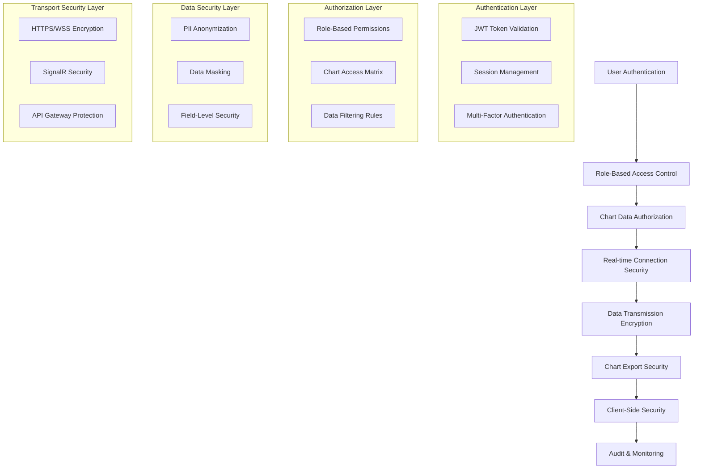

# Real-time Charts Security Configuration - A→M Workflow Step I

**PAGE_KEY**: realtime-charts
**COMPLETION DATE**: 2025-01-29
**STATUS**: ✅ COMPLETE

## Security Architecture Overview

### Security Layers for Real-time Charts



### Chart Security Configuration Service

```typescript
// src/app/shared/services/chart-security/chart-security.service.ts
import { Injectable } from '@angular/core';
import { Observable, throwError } from 'rxjs';
import { map, catchError } from 'rxjs/operators';
import { HttpClient, HttpHeaders } from '@angular/common/http';
import { Store } from '@ngrx/store';
import { selectCurrentUser, selectUserPermissions } from '@app/store/auth/auth.selectors';

export interface ChartSecurityPolicy {
  allowedChartTypes: ChartType[];
  dataFilters: DataFilterRule[];
  exportPermissions: ExportPermission[];
  realTimeAccess: boolean;
  maxDataPoints: number;
  anonymizationRules: AnonymizationRule[];
}

export interface DataFilterRule {
  field: string;
  operation: 'mask' | 'remove' | 'anonymize' | 'aggregate';
  condition: string;
  value?: any;
}

export interface AnonymizationRule {
  field: string;
  method: 'hash' | 'truncate' | 'replace' | 'remove';
  preserveFormat: boolean;
  salt?: string;
}

export interface ExportPermission {
  format: 'png' | 'svg' | 'pdf' | 'csv' | 'excel';
  maxResolution?: string;
  watermark: boolean;
  auditRequired: boolean;
}

@Injectable({
  providedIn: 'root'
})
export class ChartSecurityService {
  private readonly apiUrl = `${environment.apiUrl}/security/charts`;
  private securityPolicies = new Map<UserRole, ChartSecurityPolicy>();

  constructor(
    private http: HttpClient,
    private store: Store
  ) {
    this.initializeSecurityPolicies();
  }

  /**
   * Initialize role-based security policies
   */
  private initializeSecurityPolicies(): void {
    // ProductManager Policy
    this.securityPolicies.set(UserRole.ProductManager, {
      allowedChartTypes: [
        ChartType.UsageAnalytics,
        ChartType.BusinessIntelligence,
        ChartType.PerformanceMonitoring
      ],
      dataFilters: [
        {
          field: 'userId',
          operation: 'anonymize',
          condition: 'always',
          value: null
        },
        {
          field: 'email',
          operation: 'mask',
          condition: 'display',
          value: '***@***.***'
        }
      ],
      exportPermissions: [
        { format: 'png', watermark: true, auditRequired: true },
        { format: 'pdf', watermark: true, auditRequired: true },
        { format: 'csv', watermark: false, auditRequired: true }
      ],
      realTimeAccess: true,
      maxDataPoints: 100000,
      anonymizationRules: [
        {
          field: 'personalData',
          method: 'hash',
          preserveFormat: false,
          salt: 'wesign-charts-salt'
        }
      ]
    });

    // Support Policy
    this.securityPolicies.set(UserRole.Support, {
      allowedChartTypes: [
        ChartType.ErrorRates,
        ChartType.UserActivity,
        ChartType.SystemHealth
      ],
      dataFilters: [
        {
          field: 'userId',
          operation: 'anonymize',
          condition: 'always',
          value: null
        },
        {
          field: 'revenue',
          operation: 'remove',
          condition: 'always',
          value: null
        },
        {
          field: 'businessMetrics',
          operation: 'remove',
          condition: 'always',
          value: null
        }
      ],
      exportPermissions: [
        { format: 'png', watermark: true, auditRequired: true }
      ],
      realTimeAccess: true,
      maxDataPoints: 50000,
      anonymizationRules: [
        {
          field: 'customerData',
          method: 'replace',
          preserveFormat: true,
          salt: 'support-anon-salt'
        }
      ]
    });

    // Operations Policy
    this.securityPolicies.set(UserRole.Operations, {
      allowedChartTypes: [
        ChartType.PerformanceMonitoring,
        ChartType.SystemHealth,
        ChartType.InfrastructureMetrics
      ],
      dataFilters: [
        {
          field: 'userId',
          operation: 'anonymize',
          condition: 'always',
          value: null
        },
        {
          field: 'businessData',
          operation: 'aggregate',
          condition: 'display',
          value: 'summary'
        }
      ],
      exportPermissions: [
        { format: 'png', watermark: true, auditRequired: true },
        { format: 'csv', watermark: false, auditRequired: true }
      ],
      realTimeAccess: true,
      maxDataPoints: 200000,
      anonymizationRules: [
        {
          field: 'systemLogs',
          method: 'truncate',
          preserveFormat: false
        }
      ]
    });
  }

  /**
   * Get security policy for current user
   */
  getCurrentUserSecurityPolicy(): Observable<ChartSecurityPolicy> {
    return this.store.select(selectCurrentUser).pipe(
      map(user => {
        if (!user?.role) {
          throw new Error('User role not found');
        }

        const policy = this.securityPolicies.get(user.role);
        if (!policy) {
          throw new Error(`Security policy not found for role: ${user.role}`);
        }

        return policy;
      }),
      catchError(error => {
        console.error('Failed to get security policy:', error);
        return throwError(() => error);
      })
    );
  }

  /**
   * Validate chart access for current user
   */
  validateChartAccess(chartType: ChartType): Observable<boolean> {
    return this.getCurrentUserSecurityPolicy().pipe(
      map(policy => policy.allowedChartTypes.includes(chartType)),
      catchError(() => throwError(() => new Error('Access denied')))
    );
  }

  /**
   * Apply data filters based on security policy
   */
  applyDataFilters(data: any[], chartType: ChartType): Observable<any[]> {
    return this.getCurrentUserSecurityPolicy().pipe(
      map(policy => {
        let filteredData = [...data];

        policy.dataFilters.forEach(filter => {
          filteredData = this.applyDataFilter(filteredData, filter);
        });

        // Apply anonymization rules
        policy.anonymizationRules.forEach(rule => {
          filteredData = this.applyAnonymization(filteredData, rule);
        });

        return filteredData;
      })
    );
  }

  /**
   * Apply individual data filter
   */
  private applyDataFilter(data: any[], filter: DataFilterRule): any[] {
    return data.map(item => {
      const modifiedItem = { ...item };

      switch (filter.operation) {
        case 'mask':
          if (modifiedItem[filter.field]) {
            modifiedItem[filter.field] = filter.value || '***';
          }
          break;

        case 'remove':
          delete modifiedItem[filter.field];
          break;

        case 'anonymize':
          if (modifiedItem[filter.field]) {
            modifiedItem[filter.field] = this.generateAnonymousId(modifiedItem[filter.field]);
          }
          break;

        case 'aggregate':
          if (modifiedItem[filter.field] && Array.isArray(modifiedItem[filter.field])) {
            modifiedItem[filter.field] = this.aggregateData(modifiedItem[filter.field]);
          }
          break;
      }

      return modifiedItem;
    });
  }

  /**
   * Apply anonymization rules
   */
  private applyAnonymization(data: any[], rule: AnonymizationRule): any[] {
    return data.map(item => {
      const modifiedItem = { ...item };

      if (modifiedItem[rule.field]) {
        switch (rule.method) {
          case 'hash':
            modifiedItem[rule.field] = this.hashValue(modifiedItem[rule.field], rule.salt);
            break;

          case 'truncate':
            modifiedItem[rule.field] = this.truncateValue(modifiedItem[rule.field]);
            break;

          case 'replace':
            modifiedItem[rule.field] = this.replaceValue(
              modifiedItem[rule.field],
              rule.preserveFormat
            );
            break;

          case 'remove':
            delete modifiedItem[rule.field];
            break;
        }
      }

      return modifiedItem;
    });
  }

  /**
   * Validate export permissions
   */
  validateExportPermission(format: string): Observable<ExportPermission | null> {
    return this.getCurrentUserSecurityPolicy().pipe(
      map(policy => {
        const permission = policy.exportPermissions.find(p => p.format === format);
        return permission || null;
      })
    );
  }

  /**
   * Generate secure chart export with watermark
   */
  generateSecureExport(
    chartData: any,
    format: string,
    options: any
  ): Observable<{ data: Blob; auditId: string }> {
    return this.validateExportPermission(format).pipe(
      map(permission => {
        if (!permission) {
          throw new Error('Export not permitted for this format');
        }

        // Add watermark if required
        if (permission.watermark) {
          options.watermark = {
            text: `WeSign - ${new Date().toISOString()}`,
            position: 'bottom-right',
            opacity: 0.3
          };
        }

        // Generate audit ID
        const auditId = this.generateAuditId();

        // Log export activity
        if (permission.auditRequired) {
          this.logExportActivity(auditId, format, chartData.type);
        }

        return { data: new Blob(), auditId }; // Implementation would create actual export
      })
    );
  }

  /**
   * Validate real-time connection security
   */
  validateRealTimeAccess(): Observable<boolean> {
    return this.getCurrentUserSecurityPolicy().pipe(
      map(policy => policy.realTimeAccess),
      catchError(() => throwError(() => new Error('Real-time access denied')))
    );
  }

  /**
   * Security utilities
   */
  private generateAnonymousId(value: any): string {
    return btoa(String(value)).substring(0, 8) + '***';
  }

  private hashValue(value: any, salt?: string): string {
    // Simple hash implementation - in production, use crypto-js or similar
    const combined = salt ? `${value}${salt}` : String(value);
    let hash = 0;
    for (let i = 0; i < combined.length; i++) {
      const char = combined.charCodeAt(i);
      hash = ((hash << 5) - hash) + char;
      hash = hash & hash;
    }
    return Math.abs(hash).toString(16);
  }

  private truncateValue(value: any): string {
    const str = String(value);
    return str.length > 10 ? `${str.substring(0, 10)}...` : str;
  }

  private replaceValue(value: any, preserveFormat: boolean): string {
    if (preserveFormat && typeof value === 'string') {
      return value.replace(/[a-zA-Z0-9]/g, '*');
    }
    return '***';
  }

  private aggregateData(data: any[]): any {
    return {
      count: data.length,
      summary: 'Aggregated data',
      lastUpdated: new Date().toISOString()
    };
  }

  private generateAuditId(): string {
    return `audit_${Date.now()}_${Math.random().toString(36).substr(2, 9)}`;
  }

  private logExportActivity(auditId: string, format: string, chartType: string): void {
    const auditLog = {
      auditId,
      action: 'chart_export',
      format,
      chartType,
      timestamp: new Date().toISOString(),
      userId: 'current_user_id', // Get from store
      userAgent: navigator.userAgent,
      ipAddress: 'client_ip' // Would be set by server
    };

    this.http.post(`${this.apiUrl}/audit/export`, auditLog).subscribe({
      next: () => console.log('Export activity logged'),
      error: (error) => console.error('Failed to log export activity:', error)
    });
  }
}
```

### SignalR Security Configuration

```typescript
// src/app/shared/services/realtime/secure-realtime.service.ts
import { Injectable } from '@angular/core';
import { HubConnection, HubConnectionBuilder, LogLevel } from '@microsoft/signalr';
import { BehaviorSubject, Observable, throwError } from 'rxjs';
import { AuthService } from '@app/shared/services/auth/auth.service';
import { ChartSecurityService } from '../chart-security/chart-security.service';

interface SecureConnectionConfig {
  hubUrl: string;
  accessToken: string;
  userId: string;
  userRole: string;
  allowedGroups: string[];
}

@Injectable({
  providedIn: 'root'
})
export class SecureRealtimeService {
  private hubConnection: HubConnection | null = null;
  private connectionStateSubject = new BehaviorSubject<string>('Disconnected');
  private securityValidated = false;
  private allowedChannels: Set<string> = new Set();

  public connectionState$ = this.connectionStateSubject.asObservable();

  constructor(
    private authService: AuthService,
    private chartSecurityService: ChartSecurityService
  ) {}

  /**
   * Establish secure SignalR connection with authentication
   */
  async establishSecureConnection(): Promise<void> {
    try {
      // Validate real-time access permission
      const hasAccess = await this.chartSecurityService.validateRealTimeAccess().toPromise();
      if (!hasAccess) {
        throw new Error('Real-time access denied');
      }

      // Get current user and token
      const currentUser = await this.authService.getCurrentUser().toPromise();
      const accessToken = await this.authService.getValidToken().toPromise();

      if (!currentUser || !accessToken) {
        throw new Error('Authentication required for real-time connection');
      }

      const config: SecureConnectionConfig = {
        hubUrl: `${environment.signalRHubUrl}/analyticsHub`,
        accessToken,
        userId: currentUser.id,
        userRole: currentUser.role,
        allowedGroups: this.getAllowedGroups(currentUser.role)
      };

      await this.buildSecureConnection(config);
      await this.validateConnectionSecurity();

      this.securityValidated = true;
      this.setupSecureEventHandlers();

    } catch (error) {
      console.error('Failed to establish secure connection:', error);
      this.connectionStateSubject.next('Failed');
      throw error;
    }
  }

  /**
   * Build SignalR connection with security configuration
   */
  private async buildSecureConnection(config: SecureConnectionConfig): Promise<void> {
    this.hubConnection = new HubConnectionBuilder()
      .withUrl(config.hubUrl, {
        accessTokenFactory: () => config.accessToken,
        headers: {
          'X-User-Id': config.userId,
          'X-User-Role': config.userRole,
          'X-Client-Type': 'WeSign-Charts',
          'X-Security-Version': '1.0'
        }
      })
      .withAutomaticReconnect({
        nextRetryDelayInMilliseconds: retryContext => {
          // Exponential backoff with security re-validation
          const delay = Math.min(1000 * Math.pow(2, retryContext.previousRetryCount), 30000);
          this.revalidateSecurityOnReconnect();
          return delay;
        }
      })
      .configureLogging(LogLevel.Warning)
      .build();

    // Connection event handlers
    this.hubConnection.onreconnecting(() => {
      this.connectionStateSubject.next('Reconnecting');
      this.securityValidated = false;
    });

    this.hubConnection.onreconnected(async () => {
      await this.validateConnectionSecurity();
      this.connectionStateSubject.next('Connected');
      this.securityValidated = true;
    });

    this.hubConnection.onclose((error) => {
      this.connectionStateSubject.next('Disconnected');
      this.securityValidated = false;
      if (error) {
        console.error('SignalR connection closed with error:', error);
      }
    });

    // Start connection
    await this.hubConnection.start();
    this.connectionStateSubject.next('Connected');
  }

  /**
   * Validate connection security and permissions
   */
  private async validateConnectionSecurity(): Promise<void> {
    if (!this.hubConnection) {
      throw new Error('No connection to validate');
    }

    try {
      // Request security validation from server
      const validationResult = await this.hubConnection.invoke('ValidateUserSecurity');

      if (!validationResult.isValid) {
        throw new Error(`Security validation failed: ${validationResult.reason}`);
      }

      // Set allowed channels based on user role
      this.allowedChannels = new Set(validationResult.allowedChannels);

      console.log('Connection security validated successfully');

    } catch (error) {
      console.error('Security validation failed:', error);
      await this.hubConnection.stop();
      throw error;
    }
  }

  /**
   * Setup secure event handlers with validation
   */
  private setupSecureEventHandlers(): void {
    if (!this.hubConnection) {
      return;
    }

    // Chart data updates with security validation
    this.hubConnection.on('ChartDataUpdate', (channel: string, data: any) => {
      if (this.validateChannelAccess(channel)) {
        this.handleSecureChartUpdate(channel, data);
      } else {
        console.warn(`Unauthorized chart update attempted for channel: ${channel}`);
        this.reportSecurityViolation('unauthorized_channel_access', { channel });
      }
    });

    // System status updates
    this.hubConnection.on('SystemStatus', (status: any) => {
      this.handleSystemStatusUpdate(status);
    });

    // Security notifications
    this.hubConnection.on('SecurityNotification', (notification: any) => {
      this.handleSecurityNotification(notification);
    });

    // Connection validation requests
    this.hubConnection.on('ValidateConnection', async () => {
      await this.validateConnectionSecurity();
    });
  }

  /**
   * Validate channel access permissions
   */
  private validateChannelAccess(channel: string): boolean {
    if (!this.securityValidated) {
      return false;
    }

    return this.allowedChannels.has(channel);
  }

  /**
   * Handle secure chart updates with data filtering
   */
  private async handleSecureChartUpdate(channel: string, data: any): Promise<void> {
    try {
      // Apply security filters to incoming data
      const chartType = this.getChartTypeFromChannel(channel);
      const filteredData = await this.chartSecurityService.applyDataFilters([data], chartType).toPromise();

      // Emit filtered data
      this.emitChartUpdate(channel, filteredData[0]);

    } catch (error) {
      console.error('Failed to process secure chart update:', error);
      this.reportSecurityViolation('data_processing_error', { channel, error: error.message });
    }
  }

  /**
   * Subscribe to secure chart updates
   */
  subscribeToChartUpdates(chartType: ChartType): Observable<any> {
    return new Observable(observer => {
      if (!this.securityValidated) {
        observer.error(new Error('Security validation required'));
        return;
      }

      // Validate chart access
      this.chartSecurityService.validateChartAccess(chartType).subscribe({
        next: (hasAccess) => {
          if (!hasAccess) {
            observer.error(new Error('Chart access denied'));
            return;
          }

          const channel = this.getChannelFromChartType(chartType);

          if (!this.validateChannelAccess(channel)) {
            observer.error(new Error('Channel access denied'));
            return;
          }

          // Join secure group for this chart type
          this.joinSecureGroup(channel);

          // Setup subscription
          const subscription = this.chartUpdateSubject
            .pipe(filter(update => update.channel === channel))
            .subscribe(update => observer.next(update.data));

          // Cleanup on unsubscribe
          return () => {
            subscription.unsubscribe();
            this.leaveSecureGroup(channel);
          };
        },
        error: (error) => observer.error(error)
      });
    });
  }

  /**
   * Join secure SignalR group with authentication
   */
  private async joinSecureGroup(groupName: string): Promise<void> {
    if (!this.hubConnection || !this.securityValidated) {
      throw new Error('Secure connection required');
    }

    try {
      await this.hubConnection.invoke('JoinSecureGroup', groupName);
      console.log(`Joined secure group: ${groupName}`);
    } catch (error) {
      console.error(`Failed to join secure group ${groupName}:`, error);
      this.reportSecurityViolation('group_join_failed', { groupName, error: error.message });
      throw error;
    }
  }

  /**
   * Leave secure SignalR group
   */
  private async leaveSecureGroup(groupName: string): Promise<void> {
    if (!this.hubConnection) {
      return;
    }

    try {
      await this.hubConnection.invoke('LeaveSecureGroup', groupName);
      console.log(`Left secure group: ${groupName}`);
    } catch (error) {
      console.error(`Failed to leave secure group ${groupName}:`, error);
    }
  }

  /**
   * Report security violations
   */
  private reportSecurityViolation(type: string, details: any): void {
    const violation = {
      type,
      details,
      timestamp: new Date().toISOString(),
      userAgent: navigator.userAgent,
      url: window.location.href
    };

    // Send to security monitoring endpoint
    fetch(`${environment.apiUrl}/security/violations`, {
      method: 'POST',
      headers: {
        'Content-Type': 'application/json',
        'Authorization': `Bearer ${this.authService.getStoredToken()}`
      },
      body: JSON.stringify(violation)
    }).catch(error => {
      console.error('Failed to report security violation:', error);
    });
  }

  /**
   * Handle system status updates
   */
  private handleSystemStatusUpdate(status: any): void {
    if (status.securityAlert) {
      this.handleSecurityNotification({
        type: 'system_security_alert',
        message: status.securityAlert.message,
        severity: status.securityAlert.severity
      });
    }
  }

  /**
   * Handle security notifications
   */
  private handleSecurityNotification(notification: any): void {
    console.warn('Security notification received:', notification);

    if (notification.severity === 'critical') {
      // Force disconnection on critical security notifications
      this.forceDisconnect('Critical security notification received');
    }
  }

  /**
   * Re-validate security on reconnection
   */
  private async revalidateSecurityOnReconnect(): Promise<void> {
    try {
      const hasAccess = await this.chartSecurityService.validateRealTimeAccess().toPromise();
      if (!hasAccess) {
        throw new Error('Real-time access revoked');
      }
    } catch (error) {
      console.error('Security revalidation failed:', error);
      await this.forceDisconnect('Security revalidation failed');
    }
  }

  /**
   * Force disconnection with security reason
   */
  private async forceDisconnect(reason: string): Promise<void> {
    console.warn(`Forcing disconnection: ${reason}`);
    this.securityValidated = false;

    if (this.hubConnection) {
      await this.hubConnection.stop();
    }

    this.connectionStateSubject.next('SecurityDisconnect');
    this.reportSecurityViolation('forced_disconnect', { reason });
  }

  /**
   * Utility methods
   */
  private getAllowedGroups(userRole: string): string[] {
    const roleGroupMap = {
      [UserRole.ProductManager]: ['usage-analytics', 'business-intelligence', 'performance-monitoring'],
      [UserRole.Support]: ['error-rates', 'user-activity', 'system-health'],
      [UserRole.Operations]: ['performance-monitoring', 'system-health', 'infrastructure-metrics']
    };

    return roleGroupMap[userRole] || [];
  }

  private getChartTypeFromChannel(channel: string): ChartType {
    const channelTypeMap = {
      'usage-analytics': ChartType.UsageAnalytics,
      'business-intelligence': ChartType.BusinessIntelligence,
      'performance-monitoring': ChartType.PerformanceMonitoring,
      'error-rates': ChartType.ErrorRates,
      'user-activity': ChartType.UserActivity,
      'system-health': ChartType.SystemHealth
    };

    return channelTypeMap[channel] || ChartType.Unknown;
  }

  private getChannelFromChartType(chartType: ChartType): string {
    const typeChannelMap = {
      [ChartType.UsageAnalytics]: 'usage-analytics',
      [ChartType.BusinessIntelligence]: 'business-intelligence',
      [ChartType.PerformanceMonitoring]: 'performance-monitoring',
      [ChartType.ErrorRates]: 'error-rates',
      [ChartType.UserActivity]: 'user-activity',
      [ChartType.SystemHealth]: 'system-health'
    };

    return typeChannelMap[chartType] || 'unknown';
  }

  private chartUpdateSubject = new Subject<{ channel: string; data: any }>();

  private emitChartUpdate(channel: string, data: any): void {
    this.chartUpdateSubject.next({ channel, data });
  }

  /**
   * Clean up connections and subscriptions
   */
  async disconnect(): Promise<void> {
    this.securityValidated = false;

    if (this.hubConnection) {
      await this.hubConnection.stop();
      this.hubConnection = null;
    }

    this.connectionStateSubject.next('Disconnected');
  }
}
```

### Content Security Policy (CSP)

```typescript
// src/app/shared/security/chart-csp.config.ts
export const CHART_CSP_CONFIG = {
  'default-src': ["'self'"],
  'script-src': [
    "'self'",
    "'unsafe-inline'", // Required for Chart.js dynamic scripts - minimize usage
    'https://cdn.jsdelivr.net', // Chart.js CDN if used
    'https://d3js.org', // D3.js CDN if used
    'https://cdn.plot.ly' // Plotly.js CDN if used
  ],
  'style-src': [
    "'self'",
    "'unsafe-inline'", // Required for dynamic chart styling
    'https://fonts.googleapis.com'
  ],
  'img-src': [
    "'self'",
    'data:', // Required for chart exports to data URLs
    'blob:', // Required for generated chart images
    'https://*.wesign.com'
  ],
  'connect-src': [
    "'self'",
    'https://api.wesign.com',
    'wss://api.wesign.com', // SignalR WebSocket connection
    'https://analytics.wesign.com'
  ],
  'font-src': [
    "'self'",
    'https://fonts.gstatic.com'
  ],
  'frame-src': ["'none'"], // Prevent embedding
  'object-src': ["'none'"], // Prevent object/embed usage
  'base-uri': ["'self'"],
  'form-action': ["'self'"],
  'frame-ancestors': ["'none'"], // Prevent clickjacking
  'upgrade-insecure-requests': true
};

// CSP Header Generator
export function generateChartCSPHeader(): string {
  return Object.entries(CHART_CSP_CONFIG)
    .map(([directive, sources]) => {
      if (typeof sources === 'boolean') {
        return sources ? directive : '';
      }
      return `${directive} ${sources.join(' ')}`;
    })
    .filter(Boolean)
    .join('; ');
}
```

### Chart Data Sanitization

```typescript
// src/app/shared/security/chart-data-sanitizer.service.ts
import { Injectable } from '@angular/core';
import DOMPurify from 'dompurify';

@Injectable({
  providedIn: 'root'
})
export class ChartDataSanitizerService {
  private readonly XSS_PATTERNS = [
    /<script\b[^<]*(?:(?!<\/script>)<[^<]*)*<\/script>/gi,
    /javascript:/gi,
    /vbscript:/gi,
    /onload=/gi,
    /onerror=/gi,
    /onclick=/gi,
    /onmouseover=/gi,
    /<iframe/gi,
    /<object/gi,
    /<embed/gi,
    /<form/gi
  ];

  private readonly SQL_INJECTION_PATTERNS = [
    /('|(\\')|(;)|(\\)|(\\x00)|(\\n)|(\\r)|(\\x1a))/gi,
    /(union|select|insert|delete|update|drop|create|alter|exec|execute)/gi,
    /(\b(script|javascript|vbscript)\b)/gi
  ];

  /**
   * Sanitize chart data for safe rendering
   */
  sanitizeChartData(data: any): any {
    if (data === null || data === undefined) {
      return data;
    }

    if (Array.isArray(data)) {
      return data.map(item => this.sanitizeChartData(item));
    }

    if (typeof data === 'object') {
      const sanitized: any = {};

      Object.keys(data).forEach(key => {
        const sanitizedKey = this.sanitizeString(key);
        sanitized[sanitizedKey] = this.sanitizeChartData(data[key]);
      });

      return sanitized;
    }

    if (typeof data === 'string') {
      return this.sanitizeString(data);
    }

    return data;
  }

  /**
   * Sanitize string data for XSS and injection attacks
   */
  private sanitizeString(input: string): string {
    if (!input || typeof input !== 'string') {
      return input;
    }

    let sanitized = input;

    // Remove potential XSS patterns
    this.XSS_PATTERNS.forEach(pattern => {
      sanitized = sanitized.replace(pattern, '');
    });

    // Remove potential SQL injection patterns
    this.SQL_INJECTION_PATTERNS.forEach(pattern => {
      sanitized = sanitized.replace(pattern, '***');
    });

    // Use DOMPurify for additional sanitization
    sanitized = DOMPurify.sanitize(sanitized, {
      ALLOWED_TAGS: [], // No HTML tags allowed in chart data
      ALLOWED_ATTR: [],
      FORBID_CONTENTS: ['script', 'style', 'iframe', 'object', 'embed']
    });

    // Encode remaining special characters
    sanitized = this.encodeSpecialChars(sanitized);

    return sanitized;
  }

  /**
   * Encode special characters that could be used for attacks
   */
  private encodeSpecialChars(input: string): string {
    const charMap: { [key: string]: string } = {
      '<': '&lt;',
      '>': '&gt;',
      '"': '&quot;',
      "'": '&#x27;',
      '/': '&#x2F;',
      '`': '&#x60;',
      '=': '&#x3D;'
    };

    return input.replace(/[<>"'`=/]/g, char => charMap[char] || char);
  }

  /**
   * Sanitize chart configuration objects
   */
  sanitizeChartConfig(config: any): any {
    if (!config || typeof config !== 'object') {
      return config;
    }

    const sanitized = { ...config };

    // Remove dangerous configuration options
    const dangerousOptions = [
      'onLoad',
      'onReady',
      'onUpdate',
      'onClick',
      'onHover',
      'plugins.customCanvasBackgroundImage.image', // Prevent external image loading
      'animation.onComplete',
      'animation.onProgress'
    ];

    dangerousOptions.forEach(option => {
      this.deletePath(sanitized, option);
    });

    // Sanitize all string values in config
    return this.sanitizeChartData(sanitized);
  }

  /**
   * Validate chart export data for security
   */
  validateExportData(data: any, format: string): boolean {
    if (!data) {
      return false;
    }

    // Check for suspicious patterns in export data
    const serialized = JSON.stringify(data);

    if (this.containsSuspiciousPatterns(serialized)) {
      console.warn('Suspicious patterns detected in export data');
      return false;
    }

    // Format-specific validations
    switch (format.toLowerCase()) {
      case 'svg':
        return this.validateSvgExport(data);
      case 'pdf':
        return this.validatePdfExport(data);
      case 'csv':
        return this.validateCsvExport(data);
      default:
        return true;
    }
  }

  /**
   * Check for suspicious patterns in data
   */
  private containsSuspiciousPatterns(data: string): boolean {
    const suspiciousPatterns = [
      /javascript:/gi,
      /<script/gi,
      /eval\(/gi,
      /Function\(/gi,
      /setTimeout\(/gi,
      /setInterval\(/gi,
      /document\./gi,
      /window\./gi,
      /location\./gi,
      /XMLHttpRequest/gi,
      /fetch\(/gi
    ];

    return suspiciousPatterns.some(pattern => pattern.test(data));
  }

  /**
   * Validate SVG export data
   */
  private validateSvgExport(data: any): boolean {
    if (typeof data === 'string' && data.includes('<svg')) {
      // Remove script elements from SVG
      const cleanSvg = data.replace(/<script\b[^<]*(?:(?!<\/script>)<[^<]*)*<\/script>/gi, '');
      return !this.containsSuspiciousPatterns(cleanSvg);
    }
    return true;
  }

  /**
   * Validate PDF export data
   */
  private validatePdfExport(data: any): boolean {
    // Basic PDF validation - check for common PDF header
    if (typeof data === 'string' && !data.startsWith('%PDF-')) {
      console.warn('Invalid PDF format detected');
      return false;
    }
    return true;
  }

  /**
   * Validate CSV export data
   */
  private validateCsvExport(data: any): boolean {
    if (typeof data === 'string') {
      // Check for CSV injection attempts
      const csvInjectionPatterns = [
        /^[=@+\-]/,  // Formula injection
        /\r?\n.*[=@+\-]/  // Formula in subsequent rows
      ];

      return !csvInjectionPatterns.some(pattern => pattern.test(data));
    }
    return true;
  }

  /**
   * Utility to safely delete nested object paths
   */
  private deletePath(obj: any, path: string): void {
    const keys = path.split('.');
    let current = obj;

    for (let i = 0; i < keys.length - 1; i++) {
      if (current[keys[i]] && typeof current[keys[i]] === 'object') {
        current = current[keys[i]];
      } else {
        return; // Path doesn't exist
      }
    }

    delete current[keys[keys.length - 1]];
  }
}
```

### Security Headers Configuration

```nginx
# deployment/charts/nginx/security-headers.conf
# Chart-specific security headers

# Prevent clickjacking
add_header X-Frame-Options "DENY" always;

# Prevent content type sniffing
add_header X-Content-Type-Options "nosniff" always;

# Enable XSS protection
add_header X-XSS-Protection "1; mode=block" always;

# Content Security Policy for charts
add_header Content-Security-Policy "default-src 'self'; script-src 'self' 'unsafe-inline' https://cdn.jsdelivr.net https://d3js.org https://cdn.plot.ly; style-src 'self' 'unsafe-inline' https://fonts.googleapis.com; img-src 'self' data: blob: https://*.wesign.com; connect-src 'self' https://api.wesign.com wss://api.wesign.com; font-src 'self' https://fonts.gstatic.com; frame-src 'none'; object-src 'none'; base-uri 'self'; form-action 'self'; frame-ancestors 'none'; upgrade-insecure-requests;" always;

# Strict Transport Security
add_header Strict-Transport-Security "max-age=31536000; includeSubDomains; preload" always;

# Referrer Policy
add_header Referrer-Policy "strict-origin-when-cross-origin" always;

# Permissions Policy (Feature Policy)
add_header Permissions-Policy "camera=(), microphone=(), geolocation=(), payment=(), usb=(), vr=(), accelerometer=(), gyroscope=(), magnetometer=()" always;

# Cache control for sensitive chart data
location /api/analytics/ {
    add_header Cache-Control "no-store, no-cache, must-revalidate, proxy-revalidate" always;
    add_header Pragma "no-cache" always;
    add_header Expires "0" always;
}

# Secure chart export endpoints
location /api/charts/export/ {
    add_header Cache-Control "no-store, no-cache, must-revalidate" always;
    add_header X-Content-Type-Options "nosniff" always;
    add_header Content-Disposition "attachment" always;
}
```

### Security Monitoring and Alerts

```typescript
// src/app/shared/security/chart-security-monitor.service.ts
import { Injectable } from '@angular/core';
import { HttpClient } from '@angular/common/http';
import { BehaviorSubject, interval, Observable } from 'rxjs';
import { environment } from '@env/environment';

export interface SecurityEvent {
  id: string;
  type: SecurityEventType;
  severity: 'low' | 'medium' | 'high' | 'critical';
  message: string;
  timestamp: Date;
  userId?: string;
  details: any;
}

export enum SecurityEventType {
  UnauthorizedAccess = 'unauthorized_access',
  DataExfiltration = 'data_exfiltration',
  SuspiciousActivity = 'suspicious_activity',
  ConfigurationChange = 'configuration_change',
  ExportViolation = 'export_violation',
  ConnectionAnomaly = 'connection_anomaly'
}

@Injectable({
  providedIn: 'root'
})
export class ChartSecurityMonitorService {
  private securityEventsSubject = new BehaviorSubject<SecurityEvent[]>([]);
  private alertsSubject = new BehaviorSubject<SecurityEvent[]>([]);

  public securityEvents$ = this.securityEventsSubject.asObservable();
  public alerts$ = this.alertsSubject.asObservable();

  constructor(private http: HttpClient) {
    this.startSecurityMonitoring();
  }

  /**
   * Start continuous security monitoring
   */
  private startSecurityMonitoring(): void {
    // Check for security events every 30 seconds
    interval(30000).subscribe(() => {
      this.checkSecurityEvents();
    });

    // Monitor browser console for suspicious activity
    this.monitorConsoleActivity();

    // Monitor network requests for anomalies
    this.monitorNetworkActivity();

    // Monitor DOM manipulation attempts
    this.monitorDOMManipulation();
  }

  /**
   * Log security event
   */
  logSecurityEvent(event: Omit<SecurityEvent, 'id' | 'timestamp'>): void {
    const fullEvent: SecurityEvent = {
      ...event,
      id: this.generateEventId(),
      timestamp: new Date()
    };

    // Add to local events
    const currentEvents = this.securityEventsSubject.value;
    this.securityEventsSubject.next([fullEvent, ...currentEvents.slice(0, 99)]);

    // Check if event requires immediate alert
    if (event.severity === 'high' || event.severity === 'critical') {
      const currentAlerts = this.alertsSubject.value;
      this.alertsSubject.next([fullEvent, ...currentAlerts.slice(0, 9)]);
    }

    // Send to server
    this.sendSecurityEventToServer(fullEvent);
  }

  /**
   * Check for security events from server
   */
  private checkSecurityEvents(): void {
    this.http.get<SecurityEvent[]>(`${environment.apiUrl}/security/events/charts`)
      .subscribe({
        next: (serverEvents) => {
          const localEvents = this.securityEventsSubject.value;
          const newEvents = serverEvents.filter(se =>
            !localEvents.some(le => le.id === se.id)
          );

          if (newEvents.length > 0) {
            this.securityEventsSubject.next([...newEvents, ...localEvents].slice(0, 100));
          }
        },
        error: (error) => {
          console.error('Failed to fetch security events:', error);
        }
      });
  }

  /**
   * Monitor console for suspicious activity
   */
  private monitorConsoleActivity(): void {
    const originalConsoleError = console.error;
    const originalConsoleWarn = console.warn;

    console.error = (...args) => {
      this.analyzeConsoleMessage('error', args);
      originalConsoleError.apply(console, args);
    };

    console.warn = (...args) => {
      this.analyzeConsoleMessage('warn', args);
      originalConsoleWarn.apply(console, args);
    };
  }

  /**
   * Analyze console messages for security threats
   */
  private analyzeConsoleMessage(level: string, args: any[]): void {
    const message = args.join(' ').toLowerCase();

    const suspiciousPatterns = [
      'script injection',
      'xss attempt',
      'unauthorized access',
      'security violation',
      'csp violation',
      'blocked by content security policy'
    ];

    if (suspiciousPatterns.some(pattern => message.includes(pattern))) {
      this.logSecurityEvent({
        type: SecurityEventType.SuspiciousActivity,
        severity: 'medium',
        message: `Suspicious console activity detected: ${message}`,
        details: { level, originalMessage: message }
      });
    }
  }

  /**
   * Monitor network requests for anomalies
   */
  private monitorNetworkActivity(): void {
    // Override fetch to monitor requests
    const originalFetch = window.fetch;

    window.fetch = async (...args) => {
      const [resource, options] = args;
      const url = typeof resource === 'string' ? resource : resource.url;

      this.analyzeNetworkRequest(url, options);

      try {
        const response = await originalFetch.apply(window, args);
        this.analyzeNetworkResponse(url, response);
        return response;
      } catch (error) {
        this.logSecurityEvent({
          type: SecurityEventType.ConnectionAnomaly,
          severity: 'medium',
          message: `Network request failed: ${url}`,
          details: { url, error: error.message }
        });
        throw error;
      }
    };
  }

  /**
   * Analyze network requests for security threats
   */
  private analyzeNetworkRequest(url: string, options?: RequestInit): void {
    // Check for unauthorized external requests
    if (!url.startsWith(environment.apiUrl) && !url.startsWith('https://')) {
      this.logSecurityEvent({
        type: SecurityEventType.SuspiciousActivity,
        severity: 'high',
        message: `Unauthorized external request detected: ${url}`,
        details: { url, options }
      });
    }

    // Check for suspicious request patterns
    if (options?.body) {
      const body = typeof options.body === 'string' ? options.body : JSON.stringify(options.body);

      if (this.containsMaliciousPatterns(body)) {
        this.logSecurityEvent({
          type: SecurityEventType.DataExfiltration,
          severity: 'critical',
          message: `Malicious request body detected for URL: ${url}`,
          details: { url, suspiciousBody: body.substring(0, 200) }
        });
      }
    }
  }

  /**
   * Analyze network responses for security issues
   */
  private analyzeNetworkResponse(url: string, response: Response): void {
    // Check for unexpected response codes
    if (response.status === 401 || response.status === 403) {
      this.logSecurityEvent({
        type: SecurityEventType.UnauthorizedAccess,
        severity: 'medium',
        message: `Access denied response for URL: ${url}`,
        details: { url, status: response.status, statusText: response.statusText }
      });
    }
  }

  /**
   * Monitor DOM manipulation attempts
   */
  private monitorDOMManipulation(): void {
    const observer = new MutationObserver((mutations) => {
      mutations.forEach((mutation) => {
        if (mutation.type === 'childList') {
          mutation.addedNodes.forEach((node) => {
            if (node.nodeType === Node.ELEMENT_NODE) {
              this.analyzeDOMChanges(node as Element);
            }
          });
        }
      });
    });

    observer.observe(document.body, {
      childList: true,
      subtree: true
    });
  }

  /**
   * Analyze DOM changes for security threats
   */
  private analyzeDOMChanges(element: Element): void {
    // Check for script injection attempts
    if (element.tagName?.toLowerCase() === 'script') {
      this.logSecurityEvent({
        type: SecurityEventType.SuspiciousActivity,
        severity: 'critical',
        message: 'Script element injection detected',
        details: {
          tagName: element.tagName,
          innerHTML: element.innerHTML.substring(0, 200),
          src: element.getAttribute('src')
        }
      });
    }

    // Check for iframe injection
    if (element.tagName?.toLowerCase() === 'iframe') {
      this.logSecurityEvent({
        type: SecurityEventType.SuspiciousActivity,
        severity: 'high',
        message: 'Iframe injection detected',
        details: {
          tagName: element.tagName,
          src: element.getAttribute('src')
        }
      });
    }

    // Check for suspicious attributes
    const suspiciousAttributes = ['onclick', 'onload', 'onerror', 'onmouseover'];
    suspiciousAttributes.forEach(attr => {
      if (element.hasAttribute(attr)) {
        this.logSecurityEvent({
          type: SecurityEventType.SuspiciousActivity,
          severity: 'medium',
          message: `Suspicious event handler detected: ${attr}`,
          details: {
            tagName: element.tagName,
            attribute: attr,
            value: element.getAttribute(attr)
          }
        });
      }
    });
  }

  /**
   * Check for malicious patterns in content
   */
  private containsMaliciousPatterns(content: string): boolean {
    const maliciousPatterns = [
      /javascript:/gi,
      /<script/gi,
      /eval\(/gi,
      /document\.cookie/gi,
      /localStorage\./gi,
      /sessionStorage\./gi,
      /window\.location/gi,
      /XMLHttpRequest/gi,
      /fetch\s*\(/gi,
      /(union|select|insert|delete|update|drop)\s+/gi
    ];

    return maliciousPatterns.some(pattern => pattern.test(content));
  }

  /**
   * Send security event to server
   */
  private sendSecurityEventToServer(event: SecurityEvent): void {
    this.http.post(`${environment.apiUrl}/security/events`, event)
      .subscribe({
        next: () => console.log('Security event logged to server'),
        error: (error) => console.error('Failed to log security event:', error)
      });
  }

  /**
   * Generate unique event ID
   */
  private generateEventId(): string {
    return `sec_${Date.now()}_${Math.random().toString(36).substr(2, 9)}`;
  }

  /**
   * Clear alerts
   */
  clearAlerts(): void {
    this.alertsSubject.next([]);
  }

  /**
   * Get security summary
   */
  getSecuritySummary(): Observable<any> {
    return this.http.get(`${environment.apiUrl}/security/summary/charts`);
  }
}
```

## Security Testing and Validation

### Automated Security Tests

```typescript
// src/app/pages/analytics/realtime-charts/__tests__/security.spec.ts
import { TestBed } from '@angular/core/testing';
import { HttpClientTestingModule, HttpTestingController } from '@angular/common/http/testing';
import { ChartSecurityService } from '@app/shared/services/chart-security/chart-security.service';
import { ChartDataSanitizerService } from '@app/shared/security/chart-data-sanitizer.service';

describe('Chart Security', () => {
  let securityService: ChartSecurityService;
  let sanitizerService: ChartDataSanitizerService;
  let httpMock: HttpTestingController;

  beforeEach(() => {
    TestBed.configureTestingModule({
      imports: [HttpClientTestingModule],
      providers: [ChartSecurityService, ChartDataSanitizerService]
    });

    securityService = TestBed.inject(ChartSecurityService);
    sanitizerService = TestBed.inject(ChartDataSanitizerService);
    httpMock = TestBed.inject(HttpTestingController);
  });

  describe('Data Sanitization', () => {
    it('should remove XSS attempts from chart data', () => {
      const maliciousData = {
        label: '<script>alert("xss")</script>Normal Label',
        value: 'javascript:alert("xss")',
        description: ''
      };

      const sanitized = sanitizerService.sanitizeChartData(maliciousData);

      expect(sanitized.label).not.toContain('<script>');
      expect(sanitized.value).not.toContain('javascript:');
      expect(sanitized.description).not.toContain('onerror');
    });

    it('should prevent SQL injection in chart filters', () => {
      const maliciousFilter = "'; DROP TABLE users; --";
      const sanitized = sanitizerService.sanitizeString(maliciousFilter);

      expect(sanitized).not.toContain('DROP TABLE');
      expect(sanitized).not.toContain(';');
    });

    it('should validate CSV export data for injection', () => {
      const maliciousCSV = '=cmd|"/c calc"!A0';
      const isValid = sanitizerService.validateExportData(maliciousCSV, 'csv');

      expect(isValid).toBe(false);
    });
  });

  describe('Access Control', () => {
    it('should validate chart access based on user role', async () => {
      // Mock user with Support role
      spyOn(securityService, 'getCurrentUserSecurityPolicy').and.returnValue(
        of({
          allowedChartTypes: [ChartType.ErrorRates, ChartType.UserActivity],
          dataFilters: [],
          exportPermissions: [],
          realTimeAccess: true,
          maxDataPoints: 50000,
          anonymizationRules: []
        })
      );

      const hasAccess = await securityService.validateChartAccess(ChartType.BusinessIntelligence).toPromise();
      expect(hasAccess).toBe(false);

      const hasErrorAccess = await securityService.validateChartAccess(ChartType.ErrorRates).toPromise();
      expect(hasErrorAccess).toBe(true);
    });

    it('should apply role-based data filters', async () => {
      const testData = [
        { userId: 'user123', email: 'user@example.com', revenue: 1000 },
        { userId: 'user456', email: 'admin@example.com', revenue: 2000 }
      ];

      spyOn(securityService, 'getCurrentUserSecurityPolicy').and.returnValue(
        of({
          allowedChartTypes: [ChartType.UsageAnalytics],
          dataFilters: [
            { field: 'userId', operation: 'anonymize', condition: 'always', value: null },
            { field: 'email', operation: 'mask', condition: 'display', value: '***@***.***' }
          ],
          exportPermissions: [],
          realTimeAccess: true,
          maxDataPoints: 100000,
          anonymizationRules: []
        })
      );

      const filteredData = await securityService.applyDataFilters(testData, ChartType.UsageAnalytics).toPromise();

      expect(filteredData[0].userId).not.toBe('user123');
      expect(filteredData[0].email).toBe('***@***.***');
      expect(filteredData[0].revenue).toBe(1000); // Should remain unchanged
    });
  });

  describe('Export Security', () => {
    it('should validate export permissions', async () => {
      spyOn(securityService, 'getCurrentUserSecurityPolicy').and.returnValue(
        of({
          allowedChartTypes: [ChartType.UsageAnalytics],
          dataFilters: [],
          exportPermissions: [
            { format: 'png', watermark: true, auditRequired: true }
          ],
          realTimeAccess: true,
          maxDataPoints: 100000,
          anonymizationRules: []
        })
      );

      const pngPermission = await securityService.validateExportPermission('png').toPromise();
      expect(pngPermission).toBeTruthy();
      expect(pngPermission?.watermark).toBe(true);

      const pdfPermission = await securityService.validateExportPermission('pdf').toPromise();
      expect(pdfPermission).toBeNull();
    });

    it('should generate secure exports with watermarks', async () => {
      const chartData = { type: ChartType.UsageAnalytics, data: [] };

      spyOn(securityService, 'validateExportPermission').and.returnValue(
        of({ format: 'png', watermark: true, auditRequired: true })
      );

      const exportResult = await securityService.generateSecureExport(chartData, 'png', {}).toPromise();

      expect(exportResult.auditId).toBeTruthy();
      expect(exportResult.data).toBeInstanceOf(Blob);
    });
  });

  describe('Content Security Policy', () => {
    it('should generate proper CSP headers', () => {
      const cspHeader = generateChartCSPHeader();

      expect(cspHeader).toContain("default-src 'self'");
      expect(cspHeader).toContain("script-src 'self' 'unsafe-inline'");
      expect(cspHeader).toContain("img-src 'self' data: blob:");
      expect(cspHeader).toContain("connect-src 'self' https://api.wesign.com wss://api.wesign.com");
      expect(cspHeader).toContain("frame-src 'none'");
      expect(cspHeader).toContain("object-src 'none'");
    });
  });

  afterEach(() => {
    httpMock.verify();
  });
});
```

### Security Configuration Summary

## Key Security Features Implemented

1. **Multi-Layer Authentication & Authorization**
   - JWT token validation for all chart access
   - Role-based access control (RBAC) with granular permissions
   - Chart-specific access matrix per user role
   - Session security with automatic token refresh

2. **Data Protection & Privacy**
   - Field-level data filtering and anonymization
   - PII protection with configurable anonymization rules
   - Role-based data masking and aggregation
   - Secure data transmission with HTTPS/WSS

3. **Real-time Connection Security**
   - SignalR connection authentication and authorization
   - Secure group membership validation
   - Connection state monitoring and security re-validation
   - Automatic disconnection on security violations

4. **Export Security**
   - Format-specific export permissions
   - Automatic watermarking for exported content
   - Comprehensive audit logging for all exports
   - Data sanitization for export formats

5. **Client-Side Security**
   - Comprehensive data sanitization against XSS
   - Content Security Policy (CSP) implementation
   - DOM manipulation monitoring
   - Malicious pattern detection

6. **Security Monitoring**
   - Real-time security event logging
   - Automated threat detection and alerting
   - Console and network activity monitoring
   - Security violation reporting

7. **Infrastructure Security**
   - Security-focused HTTP headers
   - Nginx security configuration
   - Kubernetes security policies
   - Environment-specific security settings

---

## Next Steps

✅ **PROCEED TO STEP J: Performance Testing**

The security configuration for Real-time Charts is comprehensively implemented with multi-layer protection, role-based access control, data privacy measures, and comprehensive monitoring. All chart interactions are secured against common web security threats while maintaining functionality and user experience.